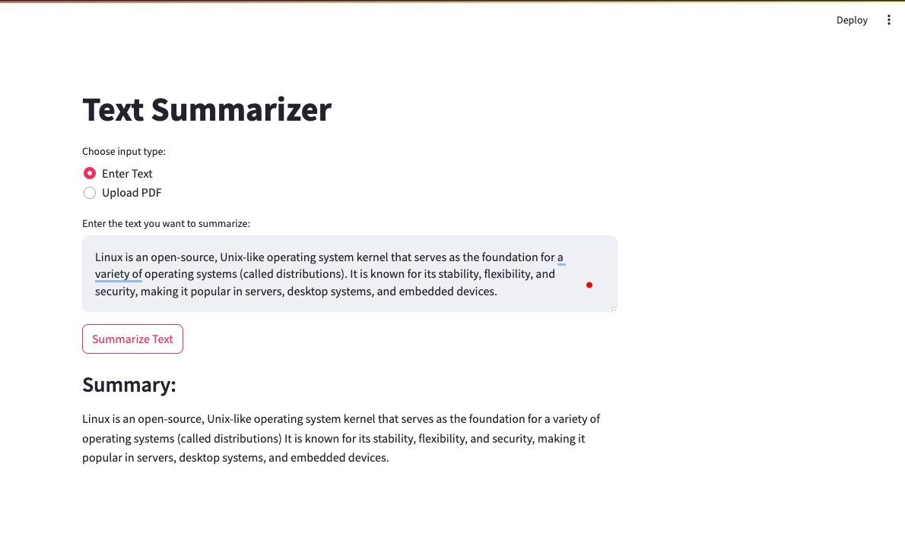

# Text Summarizer

Text Summarizer is a Streamlit web application that uses the BART (Bidirectional and Auto-Regressive Transformers) model to generate concise summaries of long texts. It supports both direct text input and PDF file uploads.



## Features

- Summarize text input directly
- Summarize content from uploaded PDF files
- Uses the state-of-the-art BART model for high-quality summaries
- User-friendly interface built with Streamlit

## Requirements

- Python 3.7+
- Streamlit
- PyTorch
- Transformers (Hugging Face)
- PyPDF2

## Installation

1. Clone this repository:
   ```
   git clone https://github.com/yourusername/text-summarizer.git
   cd text-summarizer
   ```

2. Install the required packages:
   ```
   pip install -r requirements.txt
   ```

   Note: Make sure to create a `requirements.txt` file with the following content:
   ```
   streamlit
   torch
   transformers
   PyPDF2
   ```

## Usage

1. Run the Streamlit app:
   ```
   streamlit run app.py
   ```

2. Open your web browser and go to `http://localhost:8501`.

3. Choose your input method:
   - "Enter Text": Type or paste your text directly into the text area.
   - "Upload PDF": Upload a PDF file to summarize its content.

4. Click the "Summarize" button to generate the summary.

## How it Works

1. The app uses the BART model (`facebook/bart-large-cnn`) for text summarization.
2. For PDF inputs, it extracts text using PyPDF2 before summarization.
3. The model generates a summary with a maximum length of 150 tokens and a minimum length of 50 tokens.

## Customization

You can adjust the summarization parameters in the `summarize_text` function:

- `max_length`: Maximum length of the generated summary (default: 150)
- `min_length`: Minimum length of the generated summary (default: 50)

## Contributing

Contributions are welcome! Please feel free to submit a Pull Request.

## License

This project is open source and available under the [MIT License](LICENSE).
